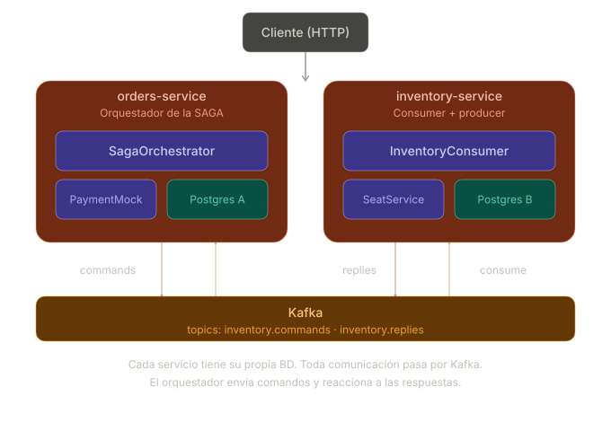
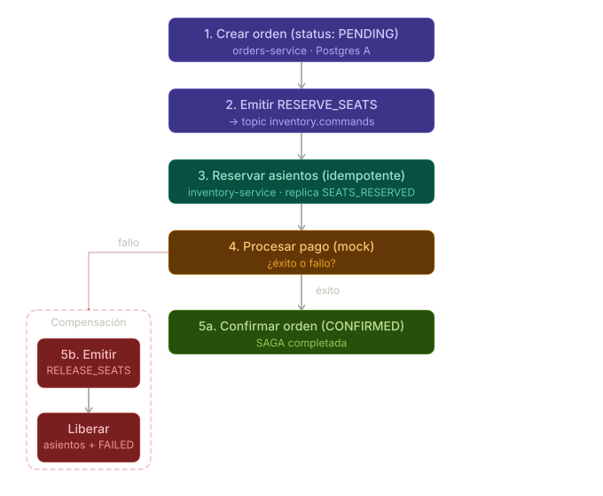

# Ticket Reservation SAGA

Implementación de una SAGA por orquestación sobre Kafka usando dos servicios NestJS. El foco está en tres conceptos: coordinación asíncrona de pasos, idempotencia en el consumidor y compensación cuando un paso falla.

El pago se simula dentro del `order-service` (falla el 50% de las veces) para mantener el scope en dos servicios sin perder el rollback real.

## Arquitectura



## Flujo de la SAGA



La operación de negocio es comprar tickets. El orquestador la divide en pasos secuenciales. Si el pago falla, emite un comando de compensación para deshacer la reserva de asientos.

## Estructura

```
kafka-implementation-service/
├── docker-compose.yml
├── order-service/                  # Orquestador de la SAGA
│   ├── prisma/schema.prisma
│   └── src/
│       ├── kafka/kafka.module.ts
│       └── orders/
│           ├── orders.controller.ts
│           ├── saga.orchestrator.ts
│           └── payment.mock.ts
└── inventory-service/              # Participante de la SAGA
    ├── prisma/schema.prisma
    └── src/
        ├── kafka/kafka.module.ts
        └── inventory/
            ├── inventory.consumer.ts
            └── seat.service.ts
```

## Infraestructura

Un solo Postgres con dos schemas (`orders` e `inventory`), Kafka y Zookeeper.

```bash
docker compose up --build
```

## Kafka topics

| Topic | Dirección | Descripción |
|---|---|---|
| `RESERVE_SEATS` | order → inventory | Comando: reservar N asientos |
| `SEATS_RESERVED` | inventory → order | Confirmación de reserva |
| `RELEASE_SEATS` | order → inventory | Compensación: liberar asientos |

## Base de datos

`order-service` — schema `orders`:

```prisma
model Order {
  id        String   @id @default(uuid())
  eventName String
  seatCount Int
  status    String   @default("PENDING")  // PENDING | CONFIRMED | FAILED
  sagaStep  String?
  createdAt DateTime @default(now())
}
```

`inventory-service` — schema `inventory`:

```prisma
model Seat {
  id        Int     @id @default(autoincrement())
  eventName String
  reserved  Boolean @default(false)
  orderId   String?
}

model ProcessedEvent {
  eventId     String   @id   // clave de idempotencia
  processedAt DateTime @default(now())
}
```

## El pasos de compensación y por qué importa el orden

Los asientos se reservan **antes** de cobrar porque liberar un asiento es trivial (un UPDATE), mientras que revertir un cobro requiere integración con el proveedor de pagos. La regla general en SAGAs: el paso más fácil de compensar va primero.
